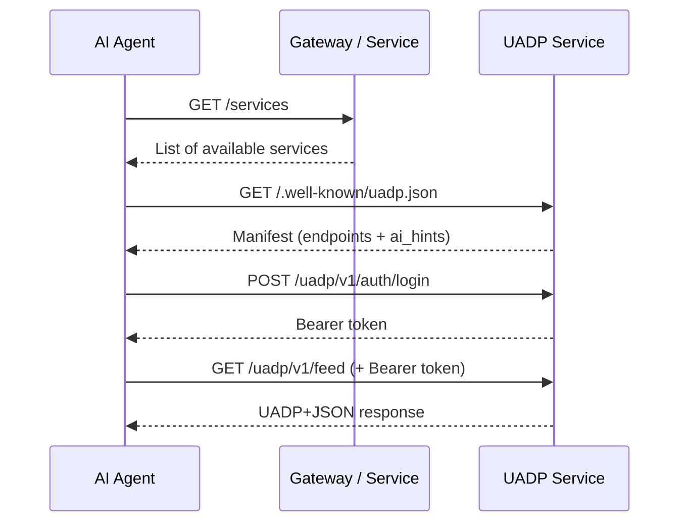
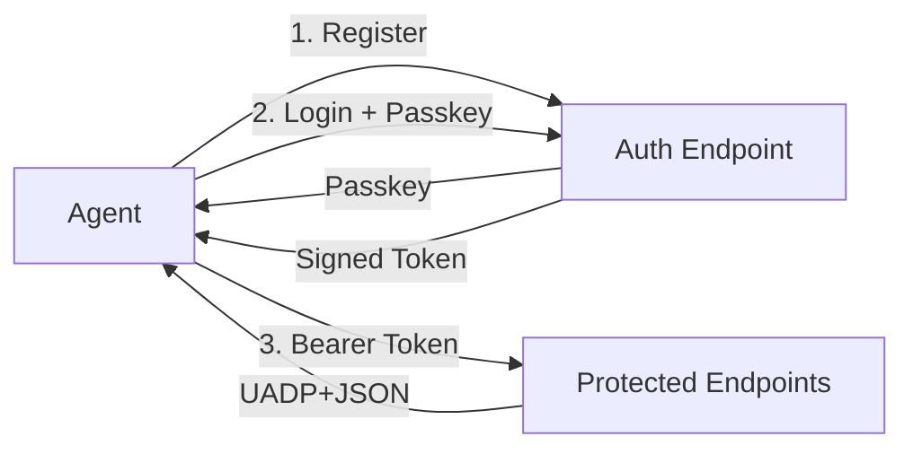

<p align="center">
  
  
  
  
</p>

# Cosmos &mdash; UADP Reference Implementation

> **Cosmos** is a fully working reference implementation of the **Universal Agentic Data Protocol (UADP)** &mdash; an open protocol that lets AI agents discover, authenticate with, and consume data from any service on the internet through a single, standardized interface.

---

## What is UADP?

Today, every service on the internet speaks its own language. An AI agent that wants to check your bank balance, read your emails, and order food has to integrate with three completely different APIs, each with its own auth flow, response format, and documentation.

**UADP fixes this.** It's a lightweight protocol layer that any service can adopt to become AI-agent-friendly in minutes:

```
                    The Problem                              The UADP Solution

    Agent ──► Bank API (REST, OAuth2, XML)          Agent ──► /.well-known/uadp.json
    Agent ──► Email API (GraphQL, API keys)                   (discover, authenticate, query)
    Agent ──► Food API (gRPC, custom auth)                    Same flow for EVERY service
```

### Core Principles

1. **Zero prior knowledge** &mdash; An agent can interact with any UADP service it has never seen before, just by reading its manifest.
2. **Self-describing services** &mdash; Every service publishes a machine-readable manifest at `/.well-known/uadp.json` with endpoints, types, and AI-specific hints.
3. **Unified response format** &mdash; All data uses UADP+JSON with a `uadp_type` field, so agents know how to parse and render any response.
4. **Built-in AI guidance** &mdash; The `ai_hints` object tells agents *how to think about* the service: what users typically want, how to render data, and what safety rules to follow.

---

## How the Protocol Works



### Step 1 &mdash; Discover

```http
GET /services
```

Returns all available UADP services:

```json
[
  { "id": "nova",   "name": "Nova",   "category": "uadp:reading_social", "url": "http://localhost:4001" },
  { "id": "orbit",  "name": "Orbit",  "category": "uadp:banking",        "url": "http://localhost:4003" },
  { "id": "beacon", "name": "Beacon", "category": "uadp:communication:email", "url": "http://localhost:4011" }
]
```

### Step 2 &mdash; Read the Manifest

Every service exposes `/.well-known/uadp.json`:

```json
{
  "service_id": "nova",
  "service_name": "Nova",
  "uadp_version": "1.0",
  "category": "uadp:reading_social",
  "base_url": "/uadp/v1",
  "endpoints": [
    { "path": "/uadp/v1/feed",        "method": "GET",  "description": "Main timeline feed",   "auth_required": true },
    { "path": "/uadp/v1/search",      "method": "GET",  "description": "Search posts",          "auth_required": true },
    { "path": "/uadp/v1/trending",    "method": "GET",  "description": "Trending topics",       "auth_required": false },
    { "path": "/uadp/v1/post/create", "method": "POST", "description": "Create a new post",     "auth_required": true }
  ],
  "ai_hints": {
    "persona": "Nova is a text-based social network for conversations about technology, culture, and daily life.",
    "rendering": { "default_view": "timeline", "date_format": "relative" },
    "user_goals": ["See what people I follow have posted", "Search posts about a topic"],
    "safety_rules": [],
    "proactive_suggestions": ["If there are 10+ unread notifications, mention it."]
  }
}
```

The manifest is the **only thing an agent needs** to interact with the service. No SDK, no docs page, no API reference &mdash; just one JSON file.

### Step 3 &mdash; Authenticate

```http
POST /uadp/v1/auth/login
Content-Type: application/json

{ "email": "user@example.com", "passkey": "ak_..." }
```

Returns a signed bearer token:

```json
{ "token": "eyJ...", "expires_in": 3600 }
```

### Step 4 &mdash; Query

Use the endpoints described in the manifest. All responses follow UADP+JSON:

```http
GET /uadp/v1/feed?limit=10&cursor=0
Authorization: Bearer eyJ...
```

```json
{
  "type": "uadp:feed",
  "cursor": "10",
  "items": [
    {
      "uadp_type": "uadp:post",
      "id": "nova:post:abc123",
      "ts": 1774302750,
      "body": "Just deployed my new project with Bun and Elysia...",
      "author": { "id": "user:alejandro_vega", "name": "Alejandro Vega", "handle": "@alejandro" },
      "likes": 142,
      "reposts": 23,
      "tags": ["bun", "elysia", "dev"]
    }
  ]
}
```

---

## The `ai_hints` Object

The most powerful part of UADP. It tells AI agents **how to think about** a service:

| Field | Purpose | Example |
|---|---|---|
| `persona` | What the service is and does | *"Nova is a text-based social network"* |
| `rendering` | How to display the data | `{ "default_view": "timeline", "date_format": "relative" }` |
| `key_concepts` | Explains non-obvious fields | `{ "ext.nova.view_count": "Total post impressions" }` |
| `user_goals` | What users typically want | `["See my feed", "Search posts"]` |
| `features` | Service capabilities | `["Personalized feed", "Real-time streaming"]` |
| `proactive_suggestions` | When to surface info unprompted | `["If 10+ unread notifications, mention it"]` |
| `platform_notes` | Rendering-specific instructions | `["Thumbnails should be prominent"]` |
| `safety_rules` | Data handling constraints | `["Mask CLABE number — show only last 4 digits"]` |
| `privacy` | Privacy constraints | `["Do not show message previews in notifications"]` |

This is what makes UADP different from OpenAPI or GraphQL introspection &mdash; it doesn't just describe *what* endpoints exist, it tells agents *why* they exist and *how* to use them intelligently.

---

## Security Model

UADP implements a layered security model designed for AI agent interactions:



### Authentication Flow

| Step | Endpoint | Description |
|---|---|---|
| **Register** | `POST /uadp/v1/auth/register` | Agent registers with email, receives a passkey |
| **Login** | `POST /uadp/v1/auth/login` | Agent presents email + passkey, receives a signed bearer token |
| **Verify** | `POST /uadp/v1/auth/verify` | Validate a token without making a data request |

### Token Format

Tokens are signed with HMAC-SHA256 and contain:

```json
{
  "sub": "user_id",
  "email": "user@example.com",
  "iat": 1774300000,
  "exp": 1774303600,
  "scope": "all"
}
```

### Endpoint-Level Access Control

Every endpoint in the manifest declares `auth_required: true | false`, so agents know upfront which endpoints need authentication:

```json
{ "path": "/uadp/v1/trending",    "auth_required": false },
{ "path": "/uadp/v1/feed",        "auth_required": true  },
{ "path": "/uadp/v1/post/create", "auth_required": true  }
```

### Safety Rules via `ai_hints`

Services can declare data-handling rules that agents **must** follow:

```json
"safety_rules": [
  "Never display full account numbers — show only last 4 digits",
  "Always confirm before initiating transfers",
  "Mask CLABE numbers in all responses"
]
```

```json
"privacy": [
  "Do not show message previews in notifications",
  "Do not summarize private conversations without explicit consent"
]
```

These rules are enforced at the agent level &mdash; the service trusts the agent to comply, and the manifest makes the rules explicit and machine-readable.

### Security as an Open Frontier

The possibilities for adding security layers to UADP are virtually infinite &mdash; this is a space wide open for exploration. The current implementation provides a functional baseline (token-based auth, endpoint-level access control, `safety_rules` in manifests), but there's a whole universe of security mechanisms that could be built on top of the protocol:

- **OAuth 2.0 / OpenID Connect** integration for real-world identity providers
- **Mutual TLS (mTLS)** between agents and services for transport-level trust
- **Scoped tokens** with fine-grained permissions (read-only, write, admin)
- **Rate limiting and abuse detection** per agent, per user, per service
- **Request signing** (HMAC or asymmetric) to guarantee message integrity
- **Audit trails** &mdash; immutable logs of every agent action for compliance
- **Agent identity verification** &mdash; cryptographic proof of which agent is making requests
- **Consent-based access** &mdash; users explicitly approve what data an agent can access per service
- **End-to-end encryption** for sensitive data like banking or messaging
- **Zero-trust architectures** where every request is verified regardless of network position

You have to start somewhere, and this reference implementation is that starting point. The protocol is designed to be extensible &mdash; new security mechanisms can be layered in without breaking existing integrations.

---

## Architecture

```mermaid
graph TD
    GW["Gateway :4000"]

    subgraph Social["Social & Content"]
        NOVA["Nova :4001<br/>Text Social"]
        PULSE["Pulse :4002<br/>Visual Social"]
        STREAM["Stream :4006<br/>Video"]
        HERALD["Herald :4008<br/>News"]
    end

    subgraph Finance["Financial"]
        ORBIT["Orbit :4003<br/>Bank"]
        ZINC["Zinc :4004<br/>Neobank"]
    end

    subgraph Commerce["Commerce & Delivery"]
        MARKET["Market :4005<br/>E-Commerce"]
        FLAME["Flame :4013<br/>Food Delivery"]
    end

    subgraph Comms["Communication"]
        ECHO["Echo :4007<br/>Messaging"]
        BEACON["Beacon :4011<br/>Email"]
    end

    subgraph Entertainment["Entertainment"]
        LYRA["Lyra :4009<br/>Music"]
        VORTEX["Vortex :4010<br/>Movies & Series"]
    end

    subgraph Lifestyle["Lifestyle"]
        COMPASS["Compass :4012<br/>Rideshare"]
        ATLAS["Atlas :4014<br/>Calendar"]
    end

    GW --> NOVA & PULSE & STREAM & HERALD
    GW --> ORBIT & ZINC
    GW --> MARKET & FLAME
    GW --> ECHO & BEACON
    GW --> LYRA & VORTEX
    GW --> COMPASS & ATLAS
```



Each service is fully independent: its own port, its own data, its own manifest.

> **Important note about this architecture:** The gateway in this project exists only for demo purposes. In a real-world scenario, **there is no central gateway**. UADP is designed so that any regular website or service on the internet can adopt the protocol independently &mdash; just publish a `/.well-known/uadp.json` manifest on your own domain, expose the UADP endpoints, and you're done. An AI agent discovers your service the same way a browser discovers a favicon: by checking a well-known path.
>
> This project simulates 14 different services behind a single gateway to showcase the protocol's capabilities in one place, but the real vision is a decentralized ecosystem where every website, app, or API speaks UADP on its own &mdash; no gateway, no middleware, no central authority needed.

---

## Quick Start

### With Docker (recommended)

```bash
git clone https://github.com/joseespana/uadp-protocol.git
cd uadp-protocol
./start.sh
```

This builds and starts all 14 services + gateway. Once running:

```bash
# Discover all services
curl http://localhost:4000/services

# Read a service manifest
curl http://localhost:4001/.well-known/uadp.json

# Query data
curl http://localhost:4001/uadp/v1/feed?limit=5

# Run the test suite
./test.sh
```

### With Bun (local development)

```bash
bun install
bun run seed    # Generate fictional data
bun run dev     # Start all services in parallel
```

### Management Commands

```bash
./start.sh              # Build & start all services
./start.sh down         # Stop everything
./start.sh logs         # Tail live logs
./start.sh logs nova    # Tail logs for a specific service
./start.sh rebuild      # Full rebuild (no cache)
./start.sh status       # Show running containers
```

---

## Services Reference

| Service | Port | Category | Description | Key Endpoints |
|---|---|---|---|---|
| **Nova** | 4001 | `reading_social` | Text social network | `/feed`, `/search`, `/trending`, `/post/create` |
| **Pulse** | 4002 | `visual_social` | Visual social network | `/feed`, `/search`, `/explore`, `/stories`, `/post/create` |
| **Orbit** | 4003 | `banking` | Primary bank | `/accounts`, `/transactions` (with search filters), `/spending/analytics` |
| **Zinc** | 4004 | `banking` | International neobank | `/accounts`, `/transactions`, `/search`, `/fx/rate`, `/fx/convert` |
| **Market** | 4005 | `commerce` | E-commerce store | `/products/search`, `/orders`, `/cart`, `/wishlist` |
| **Stream** | 4006 | `media:video` | Video platform | `/feed`, `/search`, `/history`, `/subscriptions` |
| **Echo** | 4007 | `messaging` | Instant messaging | `/inbox`, `/search`, `/conversation/:id`, `/message/send` |
| **Herald** | 4008 | `news` | News portal | `/feed/latest`, `/search`, `/feed/category/:cat` |
| **Lyra** | 4009 | `media:music` | Music streaming | `/search`, `/recently-played`, `/playlists`, `/liked` |
| **Vortex** | 4010 | `media:vod` | Movies & series | `/search`, `/continue-watching`, `/my-list`, `/catalog` |
| **Beacon** | 4011 | `communication:email` | Email client | `/inbox`, `/search`, `/folder/:folder`, `/starred` |
| **Compass** | 4012 | `transport:rideshare` | Ride-hailing | `/rides`, `/search`, `/saved-places`, `/spending` |
| **Flame** | 4013 | `food:delivery` | Food delivery | `/orders`, `/search`, `/restaurants`, `/favorites` |
| **Atlas** | 4014 | `productivity:calendar` | Calendar & events | `/events/today`, `/search`, `/events/upcoming`, `/calendars` |

All 14 services support search via `/uadp/v1/search?q=...` (or domain-specific paths like Market's `/products/search`). All return the standard `uadp:search_results` response format. Every service also exposes `/.well-known/uadp.json` and the auth endpoints (`/register`, `/login`, `/verify`).

---

## Cross-Service Search

UADP enables unified search across all services through standardized manifest declarations. An AI agent can:

1. **Discover search capabilities** from each service's `search` block in the manifest
2. **Route queries intelligently** using `domain_tags` and `relevance_weight`
3. **Parse results generically** via `response_schema.result_keys` and `response_schema.result_types`
4. **Display previews** using `preview_fields` for compact, cross-service result cards

### How Cross-Service Search Works

```
User: "Show me everything about macbook"

Agent reads manifests → matches "macbook" against domain_tags:
  Market  (relevance: 0.9, tags: [shopping, products, electronics]) → HIGH
  Stream  (relevance: 0.8, tags: [video, tutorials, reviews])       → HIGH
  Herald  (relevance: 0.8, tags: [news, articles])                  → HIGH
  Nova    (relevance: 0.7, tags: [social, posts])                   → MEDIUM
  Echo    (relevance: 0.4, tags: [messaging, chat])                 → LOW → skip

Agent calls search on top services → merges results using preview_fields:
  [Product] MacBook Pro M5 14" — $2,499 ★★★★★
  [Video]   MacBook Pro M5 review: is it worth it? — 125K views
  [Article] MacBook Pro M5: Apple's Fusion Architecture — 8 min read
  [Post]    Just upgraded to the M5 MacBook. Battery life is absurd...
```

### Standard Search Response

All services return `uadp:search_results`:

```json
{
  "type": "uadp:search_results",
  "query": "macbook",
  "items": [ { "uadp_type": "uadp:product", ... }, ... ],
  "total": 42,
  "authenticated": true
}
```

See [Search Hints](docs/service-manifest.md#search-hints) for the full manifest specification.

---

## UADP Response Format

Every response uses a consistent structure:

### Feed / List responses

```json
{
  "type": "uadp:feed",
  "cursor": "20",
  "items": [
    { "uadp_type": "uadp:post", "id": "...", "ts": 1774302750, ... },
    { "uadp_type": "uadp:post", "id": "...", "ts": 1774302600, ... }
  ]
}
```

### UADP Types

| `uadp_type` | Used by | Key fields |
|---|---|---|
| `uadp:post` | Nova | `body`, `author`, `likes`, `reposts`, `tags` |
| `uadp:media_post` | Pulse | `media_url`, `thumbnail_url`, `body`, `author`, `likes` |
| `uadp:transaction` | Orbit, Zinc | `amount`, `direction`, `merchant`, `balance_after` |
| `uadp:account` | Orbit, Zinc | `type`, `balance`, `currency` |
| `uadp:order` | Market | `items[]`, `total`, `status`, `shipping_address` |
| `uadp:product` | Market | `title`, `price`, `category`, `rating`, `image` |
| `uadp:video` | Stream | `title`, `channel`, `views`, `duration_seconds`, `thumbnail_url` |
| `uadp:article` | Herald | `title`, `summary`, `body_markdown`, `category`, `read_time_min` |
| `uadp:conversation` | Echo | `members`, `last_message`, `unread_count` |
| `uadp:message` | Echo | `body`, `author`, `ts`, `read` |
| `uadp:email` | Beacon | `subject`, `from`, `body_text`, `read`, `starred`, `attachments` |
| `uadp:track` | Lyra | `title`, `artist`, `album`, `duration_seconds` |
| `uadp:title` | Vortex | `title`, `genre`, `rating`, `poster_url`, `type` (movie/series) |
| `uadp:ride` | Compass | `origin`, `destination`, `fare`, `driver`, `ride_type` |
| `uadp:food_order` | Flame | `restaurant`, `items`, `total`, `delivery_fee` |
| `uadp:calendar_event` | Atlas | `title`, `start_ts`, `end_ts`, `calendar`, `location` |

### Pagination

Cursor-based pagination on all list endpoints:

```http
GET /uadp/v1/feed?limit=20&cursor=0
```

The `cursor` field in the response is the value to pass as `?cursor=` for the next page. When `cursor` is `null`, there are no more pages.

---

## Cross-Service Data Linking

UADP supports semantic linking between services through the `ext` field:

### Thread linking (`ext.thread`)

Items across services that share the same `ext.thread` value belong to the same narrative:

```
Nova post:          "Just ordered a MacBook Pro M4!"     → ext.thread: "macbook_m4_purchase"
Market order:       "Order #1025 — MacBook Pro M4 Pro"   → ext.thread: "macbook_m4_purchase"
Orbit transaction:  "MercadoMart - Order #1025"          → ext.thread: "macbook_m4_purchase"
Stream video:       "M4 Max MacBook Pro Review"          → ext.thread: "macbook_m4_purchase"
```

### Topic linking (`ext.topics`)

Items with overlapping `ext.topics` arrays are semantically related, enabling agents to find related content across services:

```json
{ "ext": { "topics": ["bun", "nodejs", "performance", "backend"] } }
```

### Financial cross-references

Purchases on Market, Flame, and Compass automatically generate matching transactions on Orbit/Zinc with the same timestamp and amount &mdash; enabling agents to correlate spending across services.

---

## Adopting UADP in Your Own Service

Adding UADP support to an existing service takes three steps:

### 1. Publish a manifest

Serve a JSON file at `/.well-known/uadp.json`:

```json
{
  "service_id": "my-service",
  "service_name": "My Service",
  "uadp_version": "1.0",
  "category": "uadp:your_category",
  "base_url": "/uadp/v1",
  "endpoints": [
    { "path": "/uadp/v1/items", "method": "GET", "description": "List all items", "auth_required": true }
  ],
  "ai_hints": {
    "persona": "Describe what your service does in one sentence.",
    "rendering": { "default_view": "list" },
    "user_goals": ["What do users want from this service?"],
    "safety_rules": ["Any data handling constraints"]
  }
}
```

### 2. Use UADP+JSON responses

Return data with `uadp_type` fields:

```json
{
  "type": "uadp:feed",
  "cursor": "next_page_token",
  "items": [
    {
      "uadp_type": "uadp:your_type",
      "id": "unique-id",
      "ts": 1774302750,
      "label": "Human-readable label",
      "ext": {}
    }
  ]
}
```

### 3. Implement auth endpoints (optional)

```
POST /uadp/v1/auth/register   →  { email } → { passkey }
POST /uadp/v1/auth/login      →  { email, passkey } → { token }
POST /uadp/v1/auth/verify     →  { token } → { valid, user }
```

That's it. Any UADP-compatible agent can now discover and use your service automatically.

---

## Tech Stack

| Component | Technology |
|---|---|
| Runtime | [Bun](https://bun.sh) 1.x |
| Framework | [Elysia](https://elysiajs.com) |
| Language | TypeScript |
| Data | JSON files in memory (no database) |
| Monorepo | Bun workspaces |
| Deploy | Docker Compose + Nginx reverse proxy |

---

## Project Structure

```
uadp-protocol/
├── packages/
│   ├── cosmos-core/          # Shared types, auth, token verification, data loader
│   └── cosmos-gateway/       # Gateway proxy (port 4000)
├── services/
│   ├── nova/                 # Each service has src/index.ts + package.json
│   ├── pulse/
│   ├── orbit/
│   └── ...                   # 14 services total
├── data/
│   ├── seed.ts               # Deterministic data generator
│   └── alejandro/            # Generated user data (JSON files)
├── nginx/
│   └── nginx.conf            # Reverse proxy configuration
├── docker-compose.yml
├── Dockerfile
├── start.sh                  # Docker orchestration script
└── test.sh                   # Endpoint test suite
```

---

## Author

Created by **Jose Espana**, founder of [**Perseusoft**](https://perseusoft.tech/) &mdash; [LinkedIn](https://www.linkedin.com/in/jose-espana/) &middot; [GitHub](https://github.com/joseespana)

UADP was born from a simple observation: AI agents are incredibly capable, but they're held back by the fragmented landscape of web APIs. Every new integration is a custom engineering effort. UADP proposes a world where any service can become agent-friendly by adding a single manifest file.

### The Problem Today: Scraping & Token Waste

Right now, when an AI agent needs to interact with a website, it has to **scrape the entire HTML page** &mdash; navigation bars, footers, ads, scripts, stylesheets, and thousands of lines of markup &mdash; just to extract a few pieces of useful data. This is incredibly wasteful:

- A typical webpage generates **5,000 to 50,000+ tokens** when scraped, but only **200-500 tokens** contain the actual data the agent needs.
- That means **90-99% of tokens are wasted** on irrelevant HTML, CSS classes, and JavaScript.
- Multiply that across dozens of requests per task, and agents are burning through millions of tokens just to do simple things like checking a balance or reading an email.
- This translates directly into **higher costs, slower responses, and larger context windows consumed** for every LLM in the market &mdash; OpenAI, Anthropic, Google, Meta, and every other provider.

**With UADP, a single request returns only the structured data the agent needs** &mdash; clean, typed, and ready to use. No scraping, no parsing, no wasted tokens. What today takes 30,000 tokens of scraped HTML could take **less than 500 tokens** with a UADP response. That's a **60x reduction** in token usage for the same task.

> **Need help with UADP, custom integrations, or software development?**
> At [Perseusoft](https://perseusoft.tech/) we build modern software solutions &mdash; from protocol design to full-stack products. Feel free to reach out for any project, consultation, or collaboration. We'd love to hear from you!

### Why Open Source?

UADP is released as an open-source project because we believe this is a concept that the entire community should push forward together. The idea is simple but powerful: if every service, website, and API adopts a standardized protocol for AI agents, we can **dramatically reduce token consumption across all existing LLMs**. Instead of agents wasting tokens parsing inconsistent APIs, scraping HTML, or navigating complex documentation, they get clean, structured, self-describing data in a single request.

We encourage developers, companies, and the open-source community to start adopting UADP in their own services and platforms. The more services that speak UADP, the more efficient every AI agent becomes &mdash; saving tokens, reducing costs, and making the entire ecosystem faster and smarter for everyone.

---

## Promoting UADP as a Standard

Protocols don't become standards overnight &mdash; they grow through adoption, community feedback, and formal recognition. Here's the roadmap we envision for UADP:

### Phase 1 &mdash; Community Adoption (current)
- Open-source the reference implementation (this repo)
- Encourage developers to add `/.well-known/uadp.json` to their own sites and services
- Gather real-world feedback and iterate on the spec
- Build plugins, libraries, and SDKs in multiple languages

### Phase 2 &mdash; Industry Collaboration
- Partner with AI companies (OpenAI, Anthropic, Google, etc.) to support UADP in their agents
- Propose UADP as a community standard to the **IETF** (Internet Engineering Task Force) via an Internet-Draft (I-D)
- Submit the `/.well-known/uadp.json` path for registration in the [IANA Well-Known URIs registry](https://www.iana.org/assignments/well-known-uris/)
- Engage with the **W3C** (World Wide Web Consortium) for alignment with existing web standards

### Phase 3 &mdash; Formal Standardization
- Advance the Internet-Draft to **RFC** (Request for Comments) status through the IETF process
- Establish a working group for ongoing protocol governance
- Define compliance levels and certification for UADP-compatible services

### How You Can Help Right Now

The most powerful thing you can do is **adopt UADP in your own service**. Every site that serves a `/.well-known/uadp.json` manifest is a vote for a more efficient, agent-friendly internet. You can also:

- Star this repo and share it with your network
- Open issues with feedback on the spec
- Build tools, libraries, or agents that use UADP
- Write about UADP and why token efficiency matters
- [Reach out to Perseusoft](https://perseusoft.tech/) if you want to collaborate on adoption

### Full Protocol Documentation

For detailed technical documentation on each component of the protocol, see the **[docs/](docs/)** folder:

| Document | Description |
|---|---|
| [Protocol Overview](docs/protocol-overview.md) | High-level architecture and design philosophy |
| [Service Manifest](docs/service-manifest.md) | The `/.well-known/uadp.json` spec and all its fields |
| [Endpoints](docs/endpoints.md) | Standard endpoint patterns, request/response format, pagination |
| [Authentication](docs/authentication.md) | Auth flow, token format, endpoint-level access control |
| [AI Hints](docs/ai-hints.md) | The `ai_hints` object &mdash; the heart of what makes UADP unique |
| [Security](docs/security.md) | Security model, safety rules, privacy constraints, threat model |

---

## Contributing

Contributions are welcome! Whether it's:

- **New UADP types** &mdash; Define new `uadp_type` values for domains we haven't covered
- **New services** &mdash; Add a service that simulates another real-world platform
- **Protocol improvements** &mdash; Propose changes to the UADP spec
- **Agent implementations** &mdash; Build agents that consume UADP services

Please open an issue first to discuss significant changes.

---

## License

MIT &mdash; see [LICENSE](LICENSE) for details.
