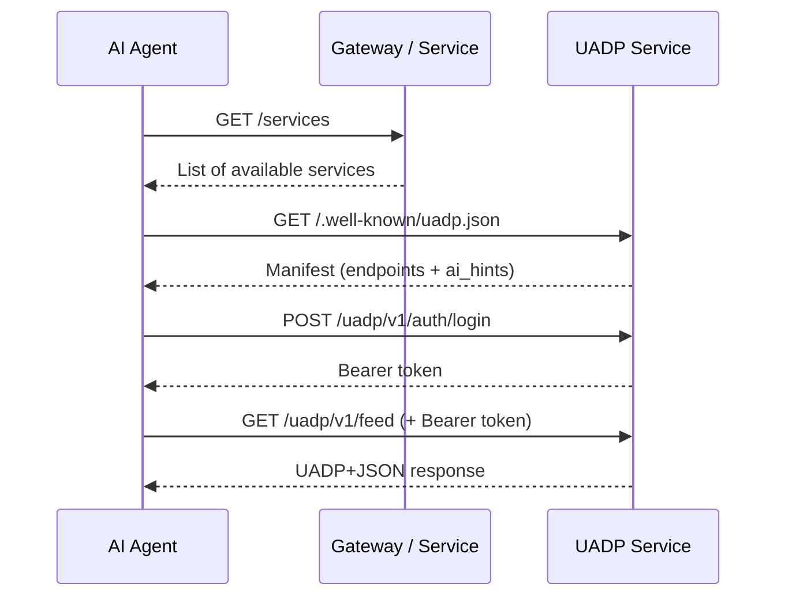
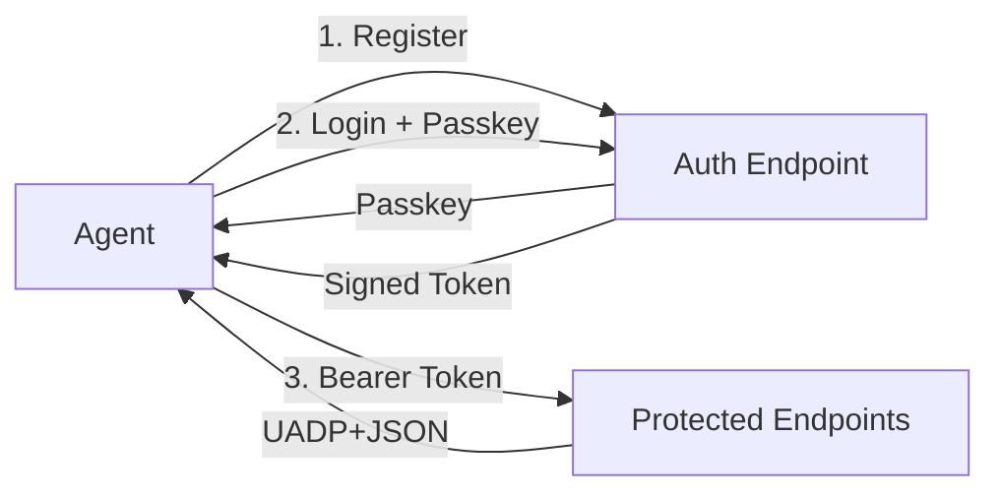

<p align="center">
  
  
  
  
</p>

# Cosmos &mdash; UADP Reference Implementation

> **Cosmos** is a fully working reference implementation of the **Universal Agentic Data Protocol (UADP)** &mdash; an open protocol that lets AI agents discover, authenticate with, and consume data from any service on the internet through a single, standardized interface.

---

## What is UADP?

Today, every service on the internet speaks its own language. An AI agent that wants to check your bank balance, read your emails, and order food has to integrate with three completely different APIs, each with its own auth flow, response format, and documentation.

**UADP fixes this.** It's a lightweight protocol layer that any service can adopt to become AI-agent-friendly in minutes:

```
                    The Problem                              The UADP Solution

    Agent ──► Bank API (REST, OAuth2, XML)          Agent ──► /.well-known/uadp.json
    Agent ──► Email API (GraphQL, API keys)                   (discover, authenticate, query)
    Agent ──► Food API (gRPC, custom auth)                    Same flow for EVERY service
```

### Core Principles

1. **Zero prior knowledge** &mdash; An agent can interact with any UADP service it has never seen before, just by reading its manifest.
2. **Self-describing services** &mdash; Every service publishes a machine-readable manifest at `/.well-known/uadp.json` with endpoints, types, and AI-specific hints.
3. **Unified response format** &mdash; All data uses UADP+JSON with a `uadp_type` field, so agents know how to parse and render any response.
4. **Built-in AI guidance** &mdash; The `ai_hints` object tells agents *how to think about* the service: what users typically want, how to render data, and what safety rules to follow.

---

## How the Protocol Works



### Step 1 &mdash; Discover

```http
GET /services
```

Returns all available UADP services:

```json
[
  { "id": "nova",   "name": "Nova",   "category": "uadp:reading_social", "url": "http://localhost:4001" },
  { "id": "orbit",  "name": "Orbit",  "category": "uadp:banking",        "url": "http://localhost:4003" },
  { "id": "beacon", "name": "Beacon", "category": "uadp:communication:email", "url": "http://localhost:4011" }
]
```

### Step 2 &mdash; Read the Manifest

Every service exposes `/.well-known/uadp.json`:

```json
{
  "service_id": "nova",
  "service_name": "Nova",
  "uadp_version": "1.0",
  "category": "uadp:reading_social",
  "base_url": "/uadp/v1",
  "endpoints": [
    { "path": "/uadp/v1/feed",        "method": "GET",  "description": "Main timeline feed",   "auth_required": true },
    { "path": "/uadp/v1/search",      "method": "GET",  "description": "Search posts",          "auth_required": true },
    { "path": "/uadp/v1/trending",    "method": "GET",  "description": "Trending topics",       "auth_required": false },
    { "path": "/uadp/v1/post/create", "method": "POST", "description": "Create a new post",     "auth_required": true }
  ],
  "ai_hints": {
    "persona": "Nova is a text-based social network for conversations about technology, culture, and daily life.",
    "rendering": { "default_view": "timeline", "date_format": "relative" },
    "user_goals": ["See what people I follow have posted", "Search posts about a topic"],
    "safety_rules": [],
    "proactive_suggestions": ["If there are 10+ unread notifications, mention it."]
  }
}
```

The manifest is the **only thing an agent needs** to interact with the service. No SDK, no docs page, no API reference &mdash; just one JSON file.

### Step 3 &mdash; Authenticate

```http
POST /uadp/v1/auth/login
Content-Type: application/json

{ "email": "user@example.com", "passkey": "ak_..." }
```

Returns a signed bearer token:

```json
{ "token": "eyJ...", "expires_in": 3600 }
```

### Step 4 &mdash; Query

Use the endpoints described in the manifest. All responses follow UADP+JSON:

```http
GET /uadp/v1/feed?limit=10&cursor=0
Authorization: Bearer eyJ...
```

```json
{
  "type": "uadp:feed",
  "cursor": "10",
  "items": [
    {
      "uadp_type": "uadp:post",
      "id": "nova:post:abc123",
      "ts": 1774302750,
      "body": "Just deployed my new project with Bun and Elysia...",
      "author": { "id": "user:alejandro_vega", "name": "Alejandro Vega", "handle": "@alejandro" },
      "likes": 142,
      "reposts": 23,
      "tags": ["bun", "elysia", "dev"]
    }
  ]
}
```

---

## The `ai_hints` Object

The most powerful part of UADP. It tells AI agents **how to think about** a service:

| Field | Purpose | Example |
|---|---|---|
| `persona` | What the service is and does | *"Nova is a text-based social network"* |
| `rendering` | How to display the data | `{ "default_view": "timeline", "date_format": "relative" }` |
| `key_concepts` | Explains non-obvious fields | `{ "ext.nova.view_count": "Total post impressions" }` |
| `user_goals` | What users typically want | `["See my feed", "Search posts"]` |
| `features` | Service capabilities | `["Personalized feed", "Real-time streaming"]` |
| `proactive_suggestions` | When to surface info unprompted | `["If 10+ unread notifications, mention it"]` |
| `platform_notes` | Rendering-specific instructions | `["Thumbnails should be prominent"]` |
| `safety_rules` | Data handling constraints | `["Mask CLABE number — show only last 4 digits"]` |
| `privacy` | Privacy constraints | `["Do not show message previews in notifications"]` |

This is what makes UADP different from OpenAPI or GraphQL introspection &mdash; it doesn't just describe *what* endpoints exist, it tells agents *why* they exist and *how* to use them intelligently.

---

## Security Model

UADP implements a layered security model designed for AI agent interactions:



### Authentication Flow

| Step | Endpoint | Description |
|---|---|---|
| **Register** | `POST /uadp/v1/auth/register` | Agent registers with email, receives a passkey |
| **Login** | `POST /uadp/v1/auth/login` | Agent presents email + passkey, receives a signed bearer token |
| **Verify** | `POST /uadp/v1/auth/verify` | Validate a token without making a data request |

### Token Format

Tokens are signed with HMAC-SHA256 and contain:

```json
{
  "sub": "user_id",
  "email": "user@example.com",
  "iat": 1774300000,
  "exp": 1774303600,
  "scope": "all"
}
```

### Endpoint-Level Access Control

Every endpoint in the manifest declares `auth_required: true | false`, so agents know upfront which endpoints need authentication:

```json
{ "path": "/uadp/v1/trending",    "auth_required": false },
{ "path": "/uadp/v1/feed",        "auth_required": true  },
{ "path": "/uadp/v1/post/create", "auth_required": true  }
```

### Safety Rules via `ai_hints`

Services can declare data-handling rules that agents **must** follow:

```json
"safety_rules": [
  "Never display full account numbers — show only last 4 digits",
  "Always confirm before initiating transfers",
  "Mask CLABE numbers in all responses"
]
```

```json
"privacy": [
  "Do not show message previews in notifications",
  "Do not summarize private conversations without explicit consent"
]
```

These rules are enforced at the agent level &mdash; the service trusts the agent to comply, and the manifest makes the rules explicit and machine-readable.

---

## Architecture

```mermaid
graph TD
    GW["Gateway :4000"]

    subgraph Social["Social & Content"]
        NOVA["Nova :4001<br/>Text Social"]
        PULSE["Pulse :4002<br/>Visual Social"]
        STREAM["Stream :4006<br/>Video"]
        HERALD["Herald :4008<br/>News"]
    end

    subgraph Finance["Financial"]
        ORBIT["Orbit :4003<br/>Bank"]
        ZINC["Zinc :4004<br/>Neobank"]
    end

    subgraph Commerce["Commerce & Delivery"]
        MARKET["Market :4005<br/>E-Commerce"]
        FLAME["Flame :4013<br/>Food Delivery"]
    end

    subgraph Comms["Communication"]
        ECHO["Echo :4007<br/>Messaging"]
        BEACON["Beacon :4011<br/>Email"]
    end

    subgraph Entertainment["Entertainment"]
        LYRA["Lyra :4009<br/>Music"]
        VORTEX["Vortex :4010<br/>Movies & Series"]
    end

    subgraph Lifestyle["Lifestyle"]
        COMPASS["Compass :4012<br/>Rideshare"]
        ATLAS["Atlas :4014<br/>Calendar"]
    end

    GW --> NOVA & PULSE & STREAM & HERALD
    GW --> ORBIT & ZINC
    GW --> MARKET & FLAME
    GW --> ECHO & BEACON
    GW --> LYRA & VORTEX
    GW --> COMPASS & ATLAS
```



Each service is fully independent: its own port, its own data, its own manifest. The gateway provides a single entry point for convenience but is not required &mdash; agents can talk to services directly.

---

## Quick Start

### With Docker (recommended)

```bash
git clone https://github.com/joseespana/uadp-protocol.git
cd uadp-protocol
./start.sh
```

This builds and starts all 14 services + gateway. Once running:

```bash
# Discover all services
curl http://localhost:4000/services

# Read a service manifest
curl http://localhost:4001/.well-known/uadp.json

# Query data
curl http://localhost:4001/uadp/v1/feed?limit=5

# Run the test suite
./test.sh
```

### With Bun (local development)

```bash
bun install
bun run seed    # Generate fictional data
bun run dev     # Start all services in parallel
```

### Management Commands

```bash
./start.sh              # Build & start all services
./start.sh down         # Stop everything
./start.sh logs         # Tail live logs
./start.sh logs nova    # Tail logs for a specific service
./start.sh rebuild      # Full rebuild (no cache)
./start.sh status       # Show running containers
```

---

## Services Reference

| Service | Port | Category | Description | Key Endpoints |
|---|---|---|---|---|
| **Nova** | 4001 | `reading_social` | Text social network | `/feed`, `/search`, `/trending`, `/post/create` |
| **Pulse** | 4002 | `visual_social` | Visual social network | `/feed`, `/explore`, `/stories`, `/post/create` |
| **Orbit** | 4003 | `banking` | Primary bank | `/accounts`, `/transactions`, `/spending/analytics`, `/transfer/initiate` |
| **Zinc** | 4004 | `banking` | International neobank | `/accounts`, `/transactions`, `/fx/rate`, `/fx/convert` |
| **Market** | 4005 | `commerce` | E-commerce store | `/products/search`, `/orders`, `/cart`, `/wishlist` |
| **Stream** | 4006 | `media:video` | Video platform | `/feed`, `/history`, `/search`, `/subscriptions` |
| **Echo** | 4007 | `messaging` | Instant messaging | `/inbox`, `/conversation/:id`, `/message/send` |
| **Herald** | 4008 | `news` | News portal | `/feed/latest`, `/feed/category/:cat`, `/search` |
| **Lyra** | 4009 | `media:music` | Music streaming | `/recently-played`, `/playlists`, `/liked`, `/now-playing` |
| **Vortex** | 4010 | `media:vod` | Movies & series | `/continue-watching`, `/my-list`, `/catalog`, `/trending` |
| **Beacon** | 4011 | `communication:email` | Email client | `/inbox`, `/folder/:folder`, `/search`, `/starred` |
| **Compass** | 4012 | `transport:rideshare` | Ride-hailing | `/rides`, `/saved-places`, `/spending` |
| **Flame** | 4013 | `food:delivery` | Food delivery | `/orders`, `/restaurants`, `/favorites`, `/spending` |
| **Atlas** | 4014 | `productivity:calendar` | Calendar & events | `/events/today`, `/events/upcoming`, `/calendars` |

All endpoints are prefixed with `/uadp/v1/`. Every service also exposes `/.well-known/uadp.json` and the auth endpoints (`/register`, `/login`, `/verify`).

---

## UADP Response Format

Every response uses a consistent structure:

### Feed / List responses

```json
{
  "type": "uadp:feed",
  "cursor": "20",
  "items": [
    { "uadp_type": "uadp:post", "id": "...", "ts": 1774302750, ... },
    { "uadp_type": "uadp:post", "id": "...", "ts": 1774302600, ... }
  ]
}
```

### UADP Types

| `uadp_type` | Used by | Key fields |
|---|---|---|
| `uadp:post` | Nova | `body`, `author`, `likes`, `reposts`, `tags` |
| `uadp:media_post` | Pulse | `media_url`, `thumbnail_url`, `body`, `author`, `likes` |
| `uadp:transaction` | Orbit, Zinc | `amount`, `direction`, `merchant`, `balance_after` |
| `uadp:account` | Orbit, Zinc | `type`, `balance`, `currency` |
| `uadp:order` | Market | `items[]`, `total`, `status`, `shipping_address` |
| `uadp:product` | Market | `title`, `price`, `category`, `rating`, `image` |
| `uadp:video` | Stream | `title`, `channel`, `views`, `duration_seconds`, `thumbnail_url` |
| `uadp:article` | Herald | `title`, `summary`, `body_markdown`, `category`, `read_time_min` |
| `uadp:conversation` | Echo | `members`, `last_message`, `unread_count` |
| `uadp:message` | Echo | `body`, `author`, `ts`, `read` |
| `uadp:email` | Beacon | `subject`, `from`, `body_text`, `read`, `starred`, `attachments` |
| `uadp:track` | Lyra | `title`, `artist`, `album`, `duration_seconds` |
| `uadp:title` | Vortex | `title`, `genre`, `rating`, `poster_url`, `type` (movie/series) |
| `uadp:ride` | Compass | `origin`, `destination`, `fare`, `driver`, `ride_type` |
| `uadp:food_order` | Flame | `restaurant`, `items`, `total`, `delivery_fee` |
| `uadp:calendar_event` | Atlas | `title`, `start_ts`, `end_ts`, `calendar`, `location` |

### Pagination

Cursor-based pagination on all list endpoints:

```http
GET /uadp/v1/feed?limit=20&cursor=0
```

The `cursor` field in the response is the value to pass as `?cursor=` for the next page. When `cursor` is `null`, there are no more pages.

---

## Cross-Service Data Linking

UADP supports semantic linking between services through the `ext` field:

### Thread linking (`ext.thread`)

Items across services that share the same `ext.thread` value belong to the same narrative:

```
Nova post:          "Just ordered a MacBook Pro M4!"     → ext.thread: "macbook_m4_purchase"
Market order:       "Order #1025 — MacBook Pro M4 Pro"   → ext.thread: "macbook_m4_purchase"
Orbit transaction:  "MercadoMart - Order #1025"          → ext.thread: "macbook_m4_purchase"
Stream video:       "M4 Max MacBook Pro Review"          → ext.thread: "macbook_m4_purchase"
```

### Topic linking (`ext.topics`)

Items with overlapping `ext.topics` arrays are semantically related, enabling agents to find related content across services:

```json
{ "ext": { "topics": ["bun", "nodejs", "performance", "backend"] } }
```

### Financial cross-references

Purchases on Market, Flame, and Compass automatically generate matching transactions on Orbit/Zinc with the same timestamp and amount &mdash; enabling agents to correlate spending across services.

---

## Adopting UADP in Your Own Service

Adding UADP support to an existing service takes three steps:

### 1. Publish a manifest

Serve a JSON file at `/.well-known/uadp.json`:

```json
{
  "service_id": "my-service",
  "service_name": "My Service",
  "uadp_version": "1.0",
  "category": "uadp:your_category",
  "base_url": "/uadp/v1",
  "endpoints": [
    { "path": "/uadp/v1/items", "method": "GET", "description": "List all items", "auth_required": true }
  ],
  "ai_hints": {
    "persona": "Describe what your service does in one sentence.",
    "rendering": { "default_view": "list" },
    "user_goals": ["What do users want from this service?"],
    "safety_rules": ["Any data handling constraints"]
  }
}
```

### 2. Use UADP+JSON responses

Return data with `uadp_type` fields:

```json
{
  "type": "uadp:feed",
  "cursor": "next_page_token",
  "items": [
    {
      "uadp_type": "uadp:your_type",
      "id": "unique-id",
      "ts": 1774302750,
      "label": "Human-readable label",
      "ext": {}
    }
  ]
}
```

### 3. Implement auth endpoints (optional)

```
POST /uadp/v1/auth/register   →  { email } → { passkey }
POST /uadp/v1/auth/login      →  { email, passkey } → { token }
POST /uadp/v1/auth/verify     →  { token } → { valid, user }
```

That's it. Any UADP-compatible agent can now discover and use your service automatically.

---

## Tech Stack

| Component | Technology |
|---|---|
| Runtime | [Bun](https://bun.sh) 1.x |
| Framework | [Elysia](https://elysiajs.com) |
| Language | TypeScript |
| Data | JSON files in memory (no database) |
| Monorepo | Bun workspaces |
| Deploy | Docker Compose + Nginx reverse proxy |

---

## Project Structure

```
uadp-protocol/
├── packages/
│   ├── cosmos-core/          # Shared types, auth, token verification, data loader
│   └── cosmos-gateway/       # Gateway proxy (port 4000)
├── services/
│   ├── nova/                 # Each service has src/index.ts + package.json
│   ├── pulse/
│   ├── orbit/
│   └── ...                   # 14 services total
├── data/
│   ├── seed.ts               # Deterministic data generator
│   └── alejandro/            # Generated user data (JSON files)
├── nginx/
│   └── nginx.conf            # Reverse proxy configuration
├── docker-compose.yml
├── Dockerfile
├── start.sh                  # Docker orchestration script
└── test.sh                   # Endpoint test suite
```

---

## Author

Created by **Jose Espana** &mdash; [LinkedIn](https://www.linkedin.com/in/jose-espana/) &middot; [GitHub](https://github.com/joseespana)

UADP was born from a simple observation: AI agents are incredibly capable, but they're held back by the fragmented landscape of web APIs. Every new integration is a custom engineering effort. UADP proposes a world where any service can become agent-friendly by adding a single manifest file.

---

## Contributing

Contributions are welcome! Whether it's:

- **New UADP types** &mdash; Define new `uadp_type` values for domains we haven't covered
- **New services** &mdash; Add a service that simulates another real-world platform
- **Protocol improvements** &mdash; Propose changes to the UADP spec
- **Agent implementations** &mdash; Build agents that consume UADP services

Please open an issue first to discuss significant changes.

---

## License

MIT &mdash; see [LICENSE](LICENSE) for details.
